# TAREA EVALUABLE 3 - SEGUNDA EVALUACIÓN
**Autor: Mauro Fernández Vegas**

**Fecha: 07/04/2023**

Despliegue de aplicaciones Web - CIFP La laboral 2022/2023

##  Ejercicio 1 - Trabajo con imágenes.
Para realizar los siguientes ejercicios utilizo la máquina virtual con la que trabajamos en clase en la que está instalada la versión de Docker que vimos en clase.
```bash
docker --version
docker images
docker ps -a
```

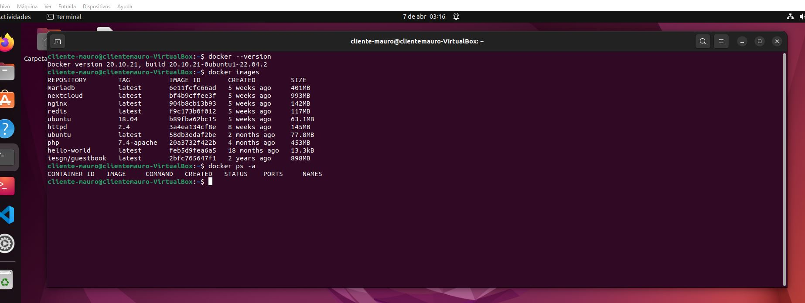

Como muestro en la captura, tengo ya descargadas varias imágenes de docker que fuimos utilizando durante las clases.

Los contenedores los he borrado todos antes de comenzar el desarrollo de esta tarea.


### 1.1 Servidor web
1. Arranca un contenedor que ejecute una instancia de la imagen `php:7.4-apache` , que se llame
servidor y que sea accesible desde un navegador en el puerto **1234**.

Para ello utilizo el siguiente comando:
```bash
docker run -d --name servidor -p 1234:80 php:7.4-apache
```
En una segunda terminal compruebo que se ha creado y esta up:
```bash
docker ps -a
```
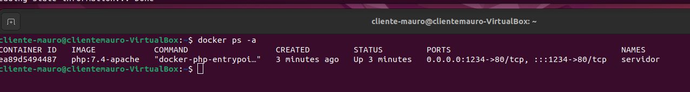

En este punto. Si abro el navegador y voy a la url `localhost:1234` me muestra un mensaje de "Forbidden de Debian Ubuntu". Entiendo que esto es porque en la carpeta raiz del servidor web, en este caso `/var/www/html/` no existe ningun archivo index.html preparado para mostrarse y se muestra ese mentaje por defecto.

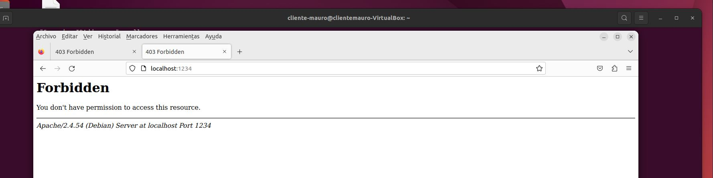


2. Ahora voy a crear un archivo index.html para que mi servidor web lo muestre en lugar del mensaje de "Forbidden". Para ello utilizo el siguiente comando para acceder a la consola del servidor web: 

```bash
docker exec -it servidor bash
```
Una vez dentro, creo el archivo index.html.

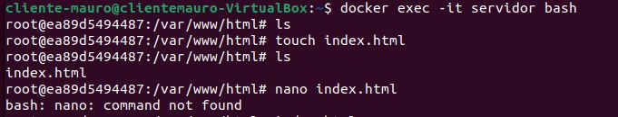

Como veo que el comando nano no lo encuentra, actualizo e instalo el joe que es mi editor favorito. Con el modificare el archivo index.html que acabo de crear.
```bash
apt update
apt install joe
joe index.html
```
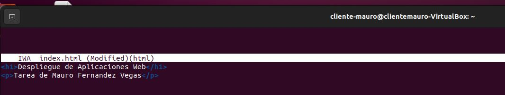

Es un index muy simple, pero funcional. Así es como se ve ahora el navegador en lugar de mostrar el "Forbidden".

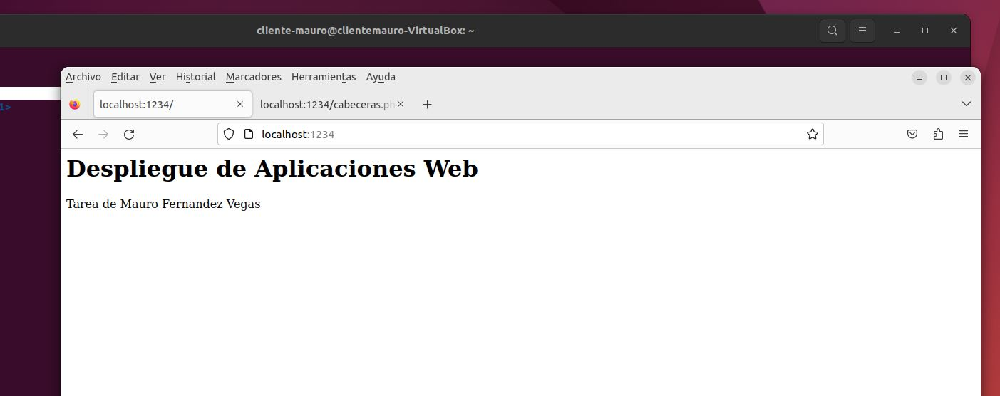

También se puede acceder al servidor a través de su ip. Para saber la ip que utiliza el servidor se puede ver con el comando `docker inspect`.
```bash
docker inspect servidor
```
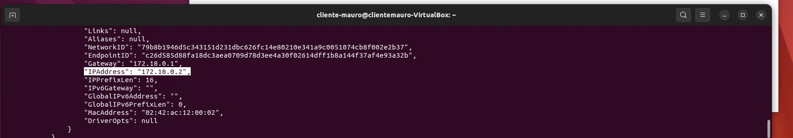

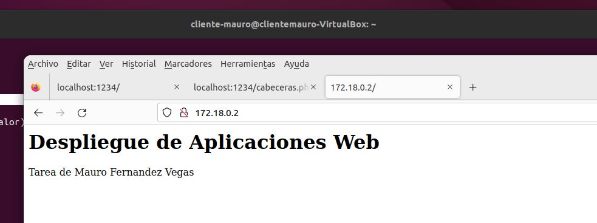

Pese a que la forma anterior es perfectamente válida, hay una forma mejor de hacerlo. En lugar de crear un archivo index.html directamente desde el servidor web, esta vez voy a descargarme una plantilla de internet, modificarla ligeramente y posteriormente la voy a copiar al contenedor.

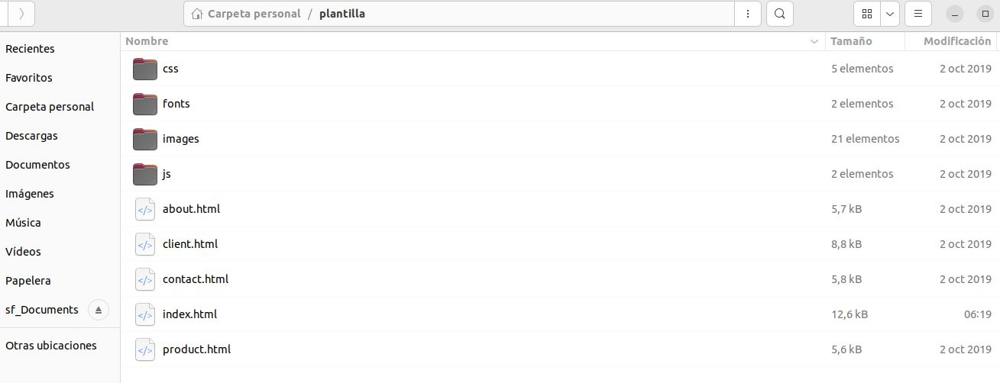

```bash
docker cp /home/cliente-mauro/plantilla servidor:/var/www/html/.
```
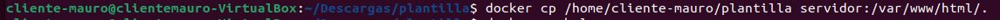

Compruebo que ha copiado la plantilla y todas las carpetas correctamente entrando a ver que hay en la carpeta `/var/www/html/`

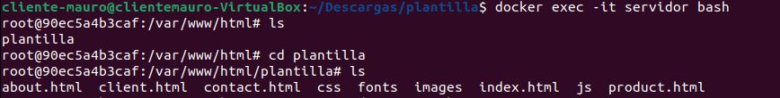

Y asi es como se ve ahora el sitio web desde el navegador: 

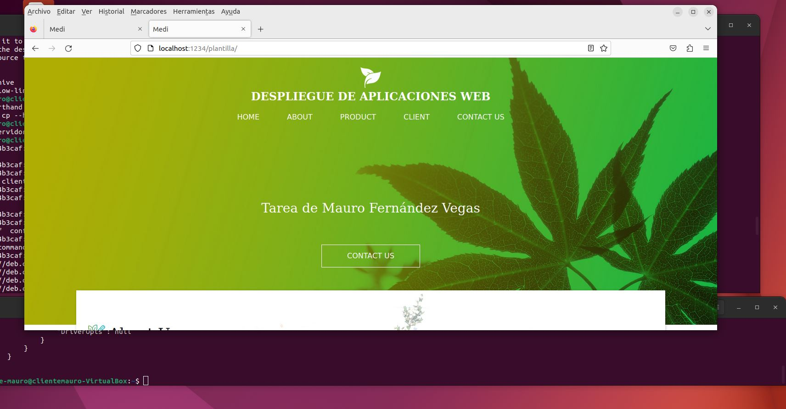


3. Ahora voy a crear otro archivo llamado cabeceras.php. Este script mostrará en la web del navegador la información de las peticiones http.
Lo creo directamente con joe, ya que ahora si lo tengo instalado.
```bash
joe cabeceras.php
```
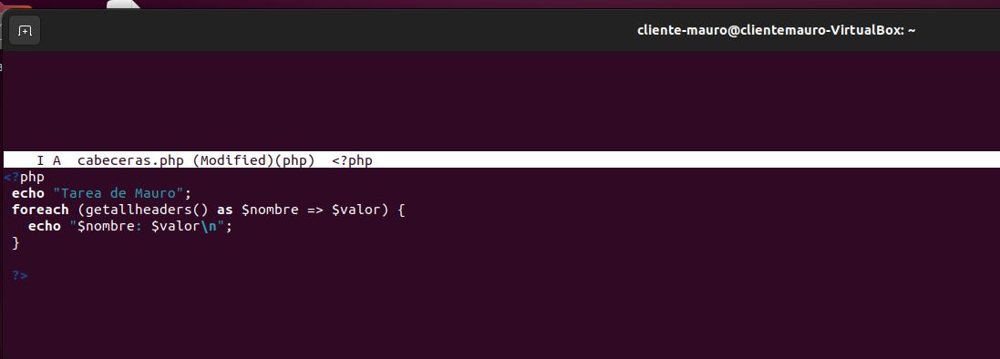

El script está sacado del propio manual de php. Simplemente le añadí mi nombre para que se vea que es de mi tarea. Una vez más es muy simple , pero funcional.

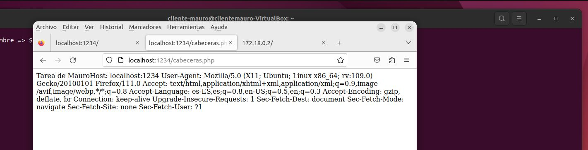

No me paro a darle formatos y dejarlo algo más bonito por falta de tiempo.

4. Compruebo el peso del contenedor una vez añadidos los archivos requeridos por el ejercicio. 
```bash
docker ps -as
```
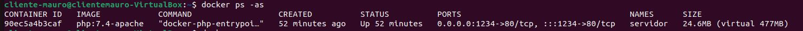

Ha pasado de pesar 2 Bytes a pesar 24.6MB. He de decir que he utilizado una plantilla que utiliza muchos recursos por lo que el aumento de peso es muy significativo. El archivo php prácticamente no pesa nada en comparación.

5. Por último, solo me queda salir y borrar el contenedor como me pide el ejercicio.

Salgo de la consola del servidor web y borro el contenedor.

```bash
exit
```

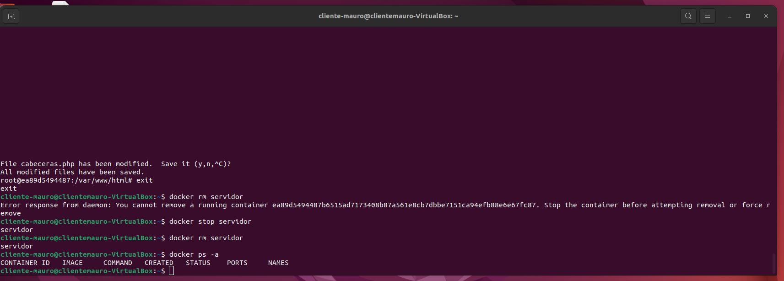


### 1.2 Servidor de base de datos
Para realizar este ejercicio utilizaré la imagen de mariadb que utilizamos en clase. Es la versión latest, lo cual no es recomendable usar, siempre es preferible una versión en concreto, pero ya que la tengo descargada la utilizo igualmente porque para esta tarea no me afecta.

Lo primero es crear el contenedor con la imagen de mariadb y declarar las 3 variables de entorno que pide el ejercicio.

```bash
docker run -d --name bbdd -e MYSQL_ROOT_PASSWORD=root -e MYSQL_DATABASE=base1 -e MYSQL_USER=daw -e MYSQL_PASSWORD=laboral1 mariadb
```
Nótese que a la vez que creo y arrando el contenedor con la imagen mariadb tambien estoy declarando 4 variables de entorno, 1 para definir el pw del usuario root, otra para crear una base de datos llamada base1 al iniciar el contenedor, y las otras dos para definir el usuario daw y la pw laboral1.

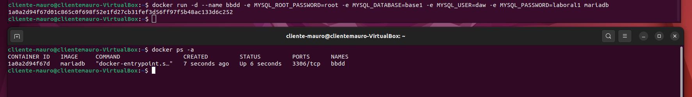

Ahora voy a conectarme a la base de datos con el usuario root y voy a crear una tabla llamada tabla1 en la base de datos base1.

Para abrir la consola de la base de datos:
```bash
docker exec -it bbdd bash
```
Para conectarme al usuario root:
```bash
mysql -u root -p
```
La pw es root como pide el ejercicio.

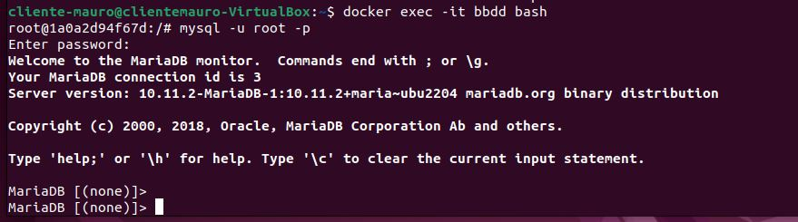

```bash
show databases;
```
Muestro las bases de datos.

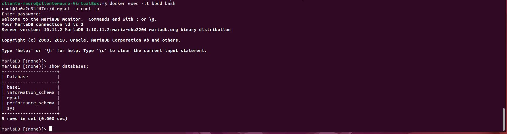

Ahora voy a crear la tabla1 en la base de datos base 1.

```bash
USE base1;
CREATE TABLE tabla1(id CHAR(2) PRIMARY KEY);
```
Nota: Para poder crear la tabla, hay que darle al menos un campo, por eso me invento el campo id de tipo CHAR y que sea primary key.

Muestro las tablas:

```bash
show tables;
```
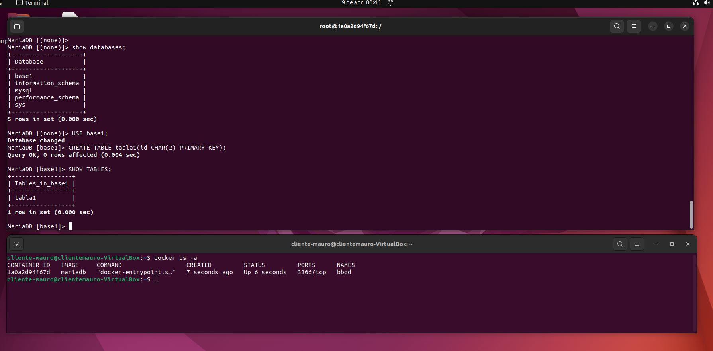

Por último, voy a salir del usuario root y a conectarme con el usuario daw que cree con las variables de entorno. 

```bash
EXIT
mysql -u daw -p
```
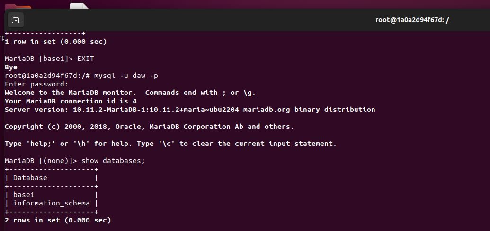

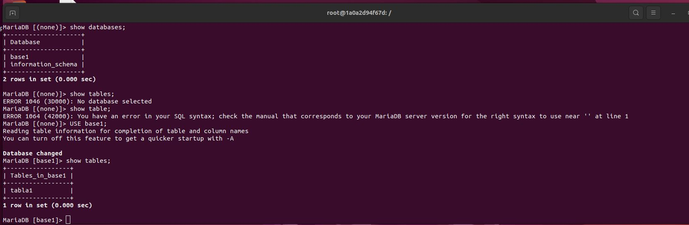

Para finalizar voy a borrar el contenedor con la imagen mariadb.
```bash
docker rmi mariadb
```
AL poner este comando, te avisa de que no puedes borrarla mientras el contenedor este en uso y referenciado a la imagen 6e11fcfc66ad que es la que quiero borrar en cuestión.

Por lo que hay que cerrar el contenedor y eliminarlo antes de eliminar la imagen asociada al mismo.

```bash
docker rm -f bbdd
```
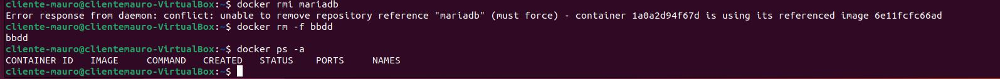

Ahora ya tengo borrado el contenedor asociado a la imagen y puedo borrarla.

```bash
docker rmi mariadb
```
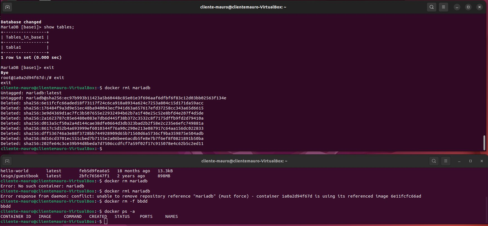

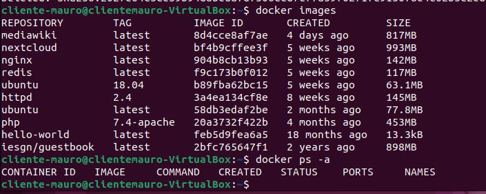

### Webgrafía

1. <a href="https://www.php.net/manual/es/function.getallheaders.php" target="_blank">www.php.net</a>

2. <a href="https://hub.docker.com/_/mariadb" target="_blank">Página oficial de docker hub</a>

