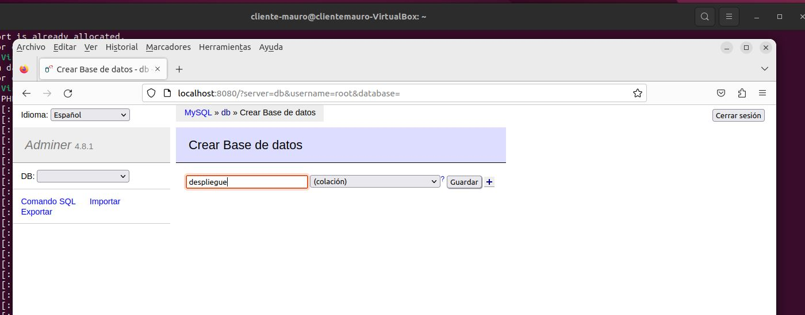
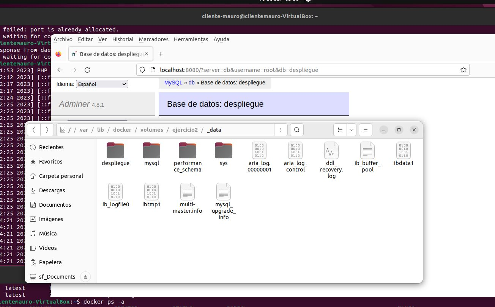
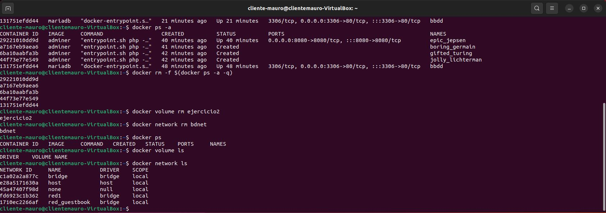

# TAREA EVALUABLE 3 - SEGUNDA EVALUACIÓN
**Autor: Mauro Fernández Vegas**

**Fecha: 07/04/2023**

Despliegue de aplicaciones Web - CIFP La laboral 2022/2023

##  Ejercicio 2 - REDES Y ALMACENAMIENTO
Creo una red bridge llamda bdnet.
```bash
docker network create bdnet
```


Ahora voy a crear un volumen con el que la base de datos será persistente. Lo llamaré ejercicio 2. 
```bash
docker volume create ejercicio2
```


Ahora que ya tengo creada la red y el volumen, ya puedo crear el contenedor con la imagen de mariadb. Siguiendo las instrucciones del ejercicio lo mapeo en el puerto 3306, declaro la variable de entorno para establecer la contraseña del usuario root y lo enlazo con la red y el volumen anteriormente creados.

```bash
docker run -d --name bbdd -p 3306:80 -v ejercicio2:/var/lib/mysql -e MYSQL_ROOT_PASSWORD=root --network bdnet 
```
Nota: para enlazar mariadb al volumen hay que utilizar la url `/var/lib/mysql`.


Ya tengo el primer contenedor listo. Ahora voy a crear el segundo contenedor. Este contrendrá la imagen del programa adminer, un gestor de bases de datos que funciona en php. Este contenedor debe estar linkeado al contenedor de la base de datos.

```bash
docker run --link bbdd:db -p 8080:8080 --network bdnet adminer
```


Esta es una captura de los 2 contenedores funcionando:


Ahora si abro el navegador y voy a la url `localhost:8080` entro en la interfaz del programa adminer. Me conecto con el usuario root.


Creo una base de datos llamada despliegue con la interfaz del adminer.



Como se puede ver en la captura, me crea la base de datos correctamente.


Por último, voy a mostrar la carpeta donde se guardan los datos de la base de datos. URL: `/var/lib/docker/volumes/ejercicio2/_data`



Para finalizar, como me pide el ejercicio borro todos los contenedores, volúmenes y redes utilizados.

```bash
docker rm -f $(docker ps -a -q)
docker volume rm ejercicio2
docker network rm bdnet
```



