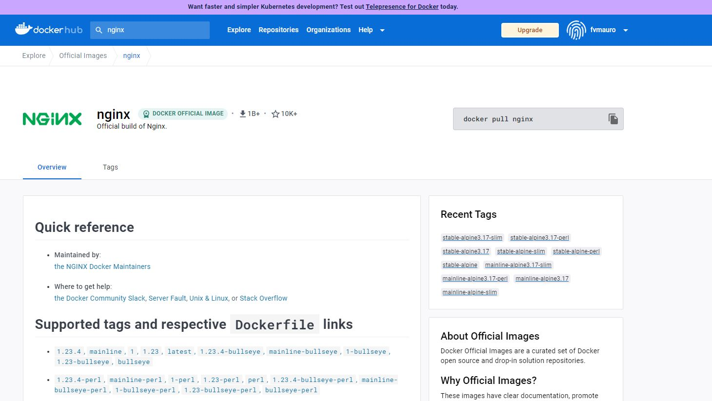
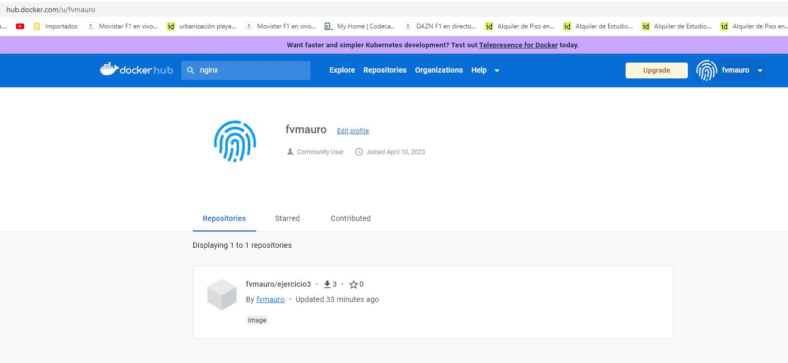

# TAREA EVALUABLE 3 - SEGUNDA EVALUACIÓN
**Autor: Mauro Fernández Vegas**

**Fecha: 010/04/2023**

Despliegue de aplicaciones Web - CIFP La laboral 2022/2023

##  Ejercicio 3 - Imagen con Dockerfile

Para crear una imagen de docker yo mismo primero voy a preparar una carpeta con los archivos necesarios que va a utilizar mi aplicación. En este caso va a ser una carpeta que contiene una plantilla con html y css y un documento Dockerfile.


El documento Dockerfile cambia en función de en que basemos nuestra imagen. Para saber como crearlo correctamente hay que acudir a docker-hub y ver la documentación, en mi caso de nginx.



En esta sección está lo que necesito.


Ya tengo la carpeta con todos los archivos que voy a utilizar listos. Ahora voy a crear mi imagen.
Nota: primero hay que situarse en la carpeta donde se encuentran los archivos Dockerfile y la plantilla, en mi caso o un index.html.


Y ahora creo la imagen.

```bash
docker build -t fvmauro/ejercicio3:v1 .
```


Compruebo que se ha creado la imagen


Ahora voy a crear un contenedor que utilice mi imagen.
```bash
docker run -d -p 4321:80 --name entregable fvmauro/ejercicio3:v1
```


Compruebo el contenedor.


En un principio parece que esta todo correcto. Abro el navegador y voy a la URL: `localhost:4321:80` para comprobar que todo funciona bien.


Como muestro en la captura, todo esta perfecto. La imagen funciona correctamente así que he decidido compartirla con todo el mundo.
Voy a compartirla en mi cuenta de docker-hub.

```bash
docker login
```


Una vez conectado a mi cuenta solo tengo que realizar un push.

```bash
docker push fvmauro/ejercicio3:v1
```


Todo parece correcto. Voy a comprobarlo en docker-hub.



Efectivamente, aquí esta. Ahora cualquier persona puede descargarse mi aplicacion con el siguiente comando: `docker pull fvmauro/ejercicio3`


## WEBGRAFÍA

1. <a href="https://hub.docker.com/" target="_blank">https://hub.docker.com/</a>


